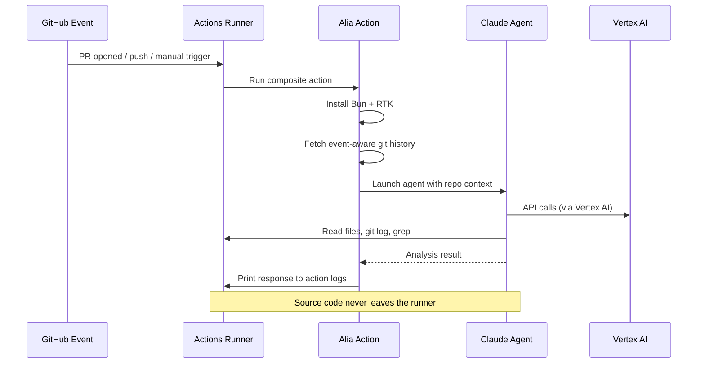
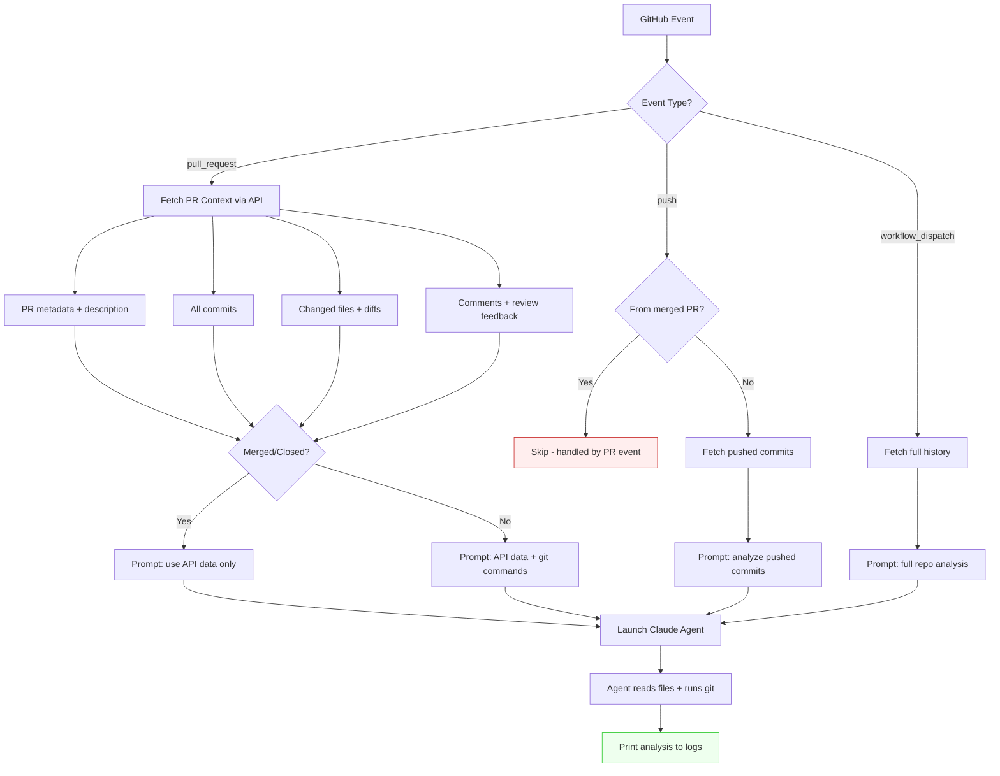

<div align="center">

# Alia Action

**AI-powered repository analysis that runs entirely on your GitHub Actions runner.**

Your code never leaves your infrastructure.

[](https://github.com/features/actions)
[](https://docs.anthropic.com/en/docs/agents-and-tools/claude-code/sdk)
[](https://cloud.google.com/vertex-ai)
[](https://bun.sh)
[](https://www.typescriptlang.org)
[](https://github.com/rtk-ai/rtk)
[](#license)

</div>

---

## How It Works

Alia runs a Claude AI agent **directly inside your GitHub Actions runner** using the [Claude Agent SDK](https://docs.anthropic.com/en/docs/agents-and-tools/claude-code/sdk). The agent has read-only access to your repository files and git history, with [RTK](https://github.com/rtk-ai/rtk) optimizing token usage by compressing command output.



## Key Features

<table>
<tr>
<td width="50%">

### Privacy First

Source code **never leaves your runner**. Only API calls to Vertex AI for inference. No code is sent to external services or stored outside your infrastructure.

</td>
<td width="50%">

### Event-Aware Analysis

Automatically adapts to the trigger context. PR analysis includes commits, files, comments, and review feedback. Push analysis focuses on exactly the pushed commits.

</td>
</tr>
<tr>
<td width="50%">

### Token Optimized

[RTK](https://github.com/rtk-ai/rtk) transparently compresses command output, achieving **60-90% token reduction** on git and file operations.

</td>
<td width="50%">

### Smart Git History

Fetches only the commits relevant to the event. No wasteful full clones for PRs or pushes.

</td>
</tr>
</table>

## Supported Events

| Event                            | Trigger               | What the Agent Sees                                                                 |
| -------------------------------- | --------------------- | ----------------------------------------------------------------------------------- |
| **Pull Request** (opened)        | PR created or updated | PR description, commits, changed files, comments, code review feedback + local repo |
| **Pull Request** (merged/closed) | PR merged or closed   | Same as above via GitHub API (local git may not reflect PR branch)                  |
| **Push** (direct to main)        | Direct push to `main` | Exactly the pushed commits and changed files                                        |
| **Manual** (`workflow_dispatch`) | "Run workflow" button | Full git history + complete repo access                                             |

> [!NOTE]
> Merged PRs trigger both a `pull_request` and `push` event. Alia automatically detects this and **skips the duplicate push run**, so you only get one analysis per merge (the richer PR-based one).

## Setup

### Prerequisites

- A Google Cloud project with **Vertex AI** enabled
- [Workload Identity Federation](https://cloud.google.com/iam/docs/workload-identity-federation) configured for GitHub Actions
- A service account with Vertex AI permissions

### 1. Configure Secrets

Add these secrets to your repository (`Settings > Secrets and variables > Actions`):

| Secret                     | Description                                                                |
| -------------------------- | -------------------------------------------------------------------------- |
| `WIF_PROVIDER`             | Workload Identity Federation provider resource name (provided by Alia)     |
| `WIF_SERVICE_ACCOUNT`      | Service account email with Vertex AI access (provided by Alia)             |
| `ALIA_BACKEND_URL`         | Alia backend base URL (provided by Alia)                                   |
| `ALIA_SAVE_INSIGHTS_ROUTE` | Route for posting analysis insights to the backend (provided by Alia)      |
| `ALIA_SKILL_STORE_ROUTE`   | Route for fetching the analysis skill bundle from the backend (provided by Alia) |

> Contact the Alia team to receive the values for these secrets and to add your GitHub organization to the install allow list.

### 2. Create the Workflow

Create `.github/workflows/alia.yml`:

```yaml
name: Alia PR Analysis

on:
  workflow_dispatch:
  pull_request:
    types: [opened, reopened, synchronize, closed]
  push:
    branches: [main]

permissions:
  id-token: write
  contents: read
  pull-requests: read

jobs:
  analyze:
    runs-on: ubuntu-latest
    steps:
      - uses: actions/checkout@v5

      - name: Authenticate to Google Cloud
        id: auth
        uses: google-github-actions/auth@v3
        with:
          workload_identity_provider: ${{ secrets.WIF_PROVIDER }}
          service_account: ${{ secrets.WIF_SERVICE_ACCOUNT }}

      - name: Run Alia Action
        uses: Prosieve-Inc/alia-action@main
        env:
          ANTHROPIC_VERTEX_PROJECT_ID: ${{ steps.auth.outputs.project_id }}
          ALIA_BACKEND_URL: ${{ secrets.ALIA_BACKEND_URL }}
          ALIA_SKILL_STORE_ROUTE: ${{ secrets.ALIA_SKILL_STORE_ROUTE }}
          ALIA_SAVE_INSIGHTS_ROUTE: ${{ secrets.ALIA_SAVE_INSIGHTS_ROUTE }}
```

### 3. Required Permissions

The workflow needs these GitHub token permissions:

| Permission      | Level   | Reason                                         |
| --------------- | ------- | ---------------------------------------------- |
| `id-token`      | `write` | Workload Identity Federation with Google Cloud |
| `contents`      | `read`  | Checkout repository and read files             |
| `pull-requests` | `read`  | Fetch PR data, comments, and detect merged PRs |

## Architecture

```
alia-action/
├── action.yml                  # Composite action definition
├── src/
│   ├── main.ts                 # Entry point and orchestrator
│   ├── config/
│   │   └── inputs.ts           # Environment validation
│   ├── events/
│   │   ├── claude-test.ts      # Agent SDK configuration and execution
│   │   ├── router.ts           # Event dispatcher
│   │   ├── issue-comment.ts    # PR comment handler
│   │   ├── pull-request-closed.ts
│   │   └── push.ts             # Push-to-main handler
│   ├── github/
│   │   ├── client.ts           # Octokit factory
│   │   ├── types.ts            # TypeScript interfaces
│   │   ├── data-fetcher.ts     # GitHub API calls (PR data, comments, files)
│   │   └── data-formatter.ts   # Format context to human-readable text
│   └── utils/
│       ├── logger.ts           # Structured logging via @actions/core
│       └── errors.ts           # Error handling with fatal/non-fatal distinction
└── test/                       # Bun test suite
```

## How the Action Pipeline Works



## Agent Capabilities

The Claude agent runs with **read-only** access:

<details>
<summary><strong>File System Tools</strong></summary>

| Tool   | Description                     |
| ------ | ------------------------------- |
| `Read` | Read file contents              |
| `Glob` | Find files by pattern           |
| `Grep` | Search file contents with regex |
| `LS`   | List directory contents         |

</details>

<details>
<summary><strong>Git Commands</strong> (via Bash)</summary>

| Command      | Description              |
| ------------ | ------------------------ |
| `git log`    | View commit history      |
| `git diff`   | Compare changes          |
| `git status` | Repository status        |
| `git show`   | Inspect commits          |
| `git blame`  | Line-by-line attribution |
| `git branch` | List branches            |

All git commands are automatically routed through [RTK](https://github.com/rtk-ai/rtk) for token-efficient output.

</details>

> [!IMPORTANT]
> The agent has **no write access**. Tools like `Edit`, `Write`, `git push`, `git commit` are explicitly excluded.

## Event-Aware Git Fetch

Instead of cloning the full repository history, Alia fetches only what's needed:

| Event               | Git Fetch Strategy                                  |
| ------------------- | --------------------------------------------------- |
| `pull_request`      | Base branch + PR commit count                       |
| `push`              | Exact number of pushed commits (from event payload) |
| `workflow_dispatch` | Full `--unshallow` for complete history             |

This means a squash merge fetches 1 commit, a merge with 100 commits fetches all 100, and a manual trigger gets the full history.

## Tech Stack

| Technology                                                                              | Role                                                  |
| --------------------------------------------------------------------------------------- | ----------------------------------------------------- |
| [Claude Agent SDK](https://docs.anthropic.com/en/docs/agents-and-tools/claude-code/sdk) | AI agent orchestration                                |
| [Vertex AI](https://cloud.google.com/vertex-ai)                                         | Claude model hosting (data stays in your GCP project) |
| [RTK](https://github.com/rtk-ai/rtk)                                                    | Token-efficient command output filtering              |
| [Bun](https://bun.sh)                                                                   | TypeScript runtime and package manager                |
| [TypeScript](https://www.typescriptlang.org)                                            | Type-safe codebase with strict mode                   |
| [Octokit](https://github.com/octokit/rest.js)                                           | GitHub REST API client                                |
| [@actions/core](https://github.com/actions/toolkit/tree/main/packages/core)             | GitHub Actions toolkit for logging and inputs         |

## Development

```bash
# Install dependencies
bun install

# Run tests
bun test

# Type check
bun run typecheck

# Format code
bun run format
```

## License

Proprietary — see [LICENSE](LICENSE).

This software is made publicly visible solely so that the GitHub Actions runtime can execute it via `uses: Prosieve-Inc/alia-action@<ref>` in repositories where the official Alia Analyzer GitHub App has been installed and authorized. All other rights — including reproduction, modification, redistribution, derivative works, and reverse engineering — are reserved.

For licensing inquiries: thomas@usealia.com
